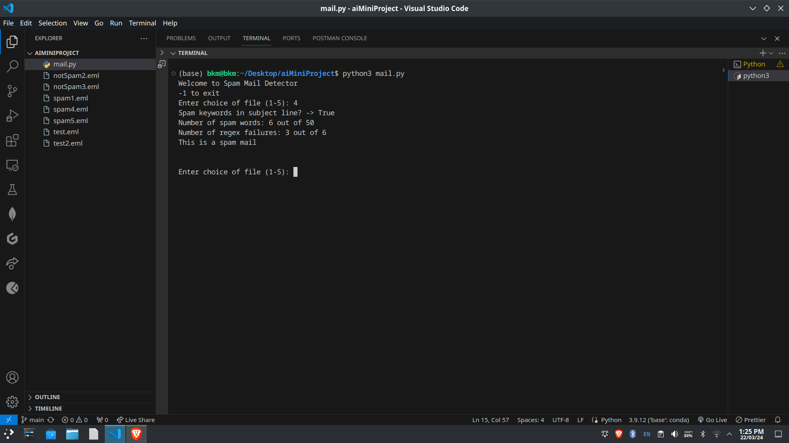
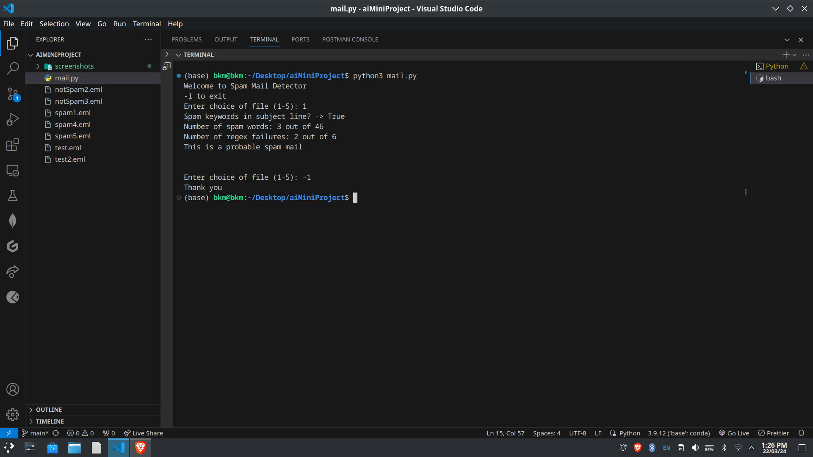

### Spam Mail Detector
Welcome to the Spam Mail Detector repository! This project aims to detect spam emails by analyzing their 
subject lines and content. It includes functions to parse email files, preprocess text data, and apply checks for spam indicators.

# Features
- **Email Parsing**: Extracts email headers and body content from email files.
- **Text Preprocessing**: Cleans and tokenizes text data for analysis.
- **Subject Line Check**: Identifies spam keywords in email subject lines.
- **Content Analysis**: Evaluates content for spam indicators using regular expressions and predefined spam words.
- **Spam Classification**: Determines whether an email is spam based on analysis results.

Run the program and choose an email file (1-5) or exit (-1) to analyze. The program will display the results of the spam detection analysis.

# File Structure
- spam_mail_detector.py: Python script containing functions for email parsing, text preprocessing, and spam detection.
- spam1.eml, spam2.eml, spam3.eml, spam4.eml, spam5.eml: Sample spam email files.
- notSpam1.eml, notSpam2.eml, notSpam3.eml: Sample non-spam email files.

#Screenshots

